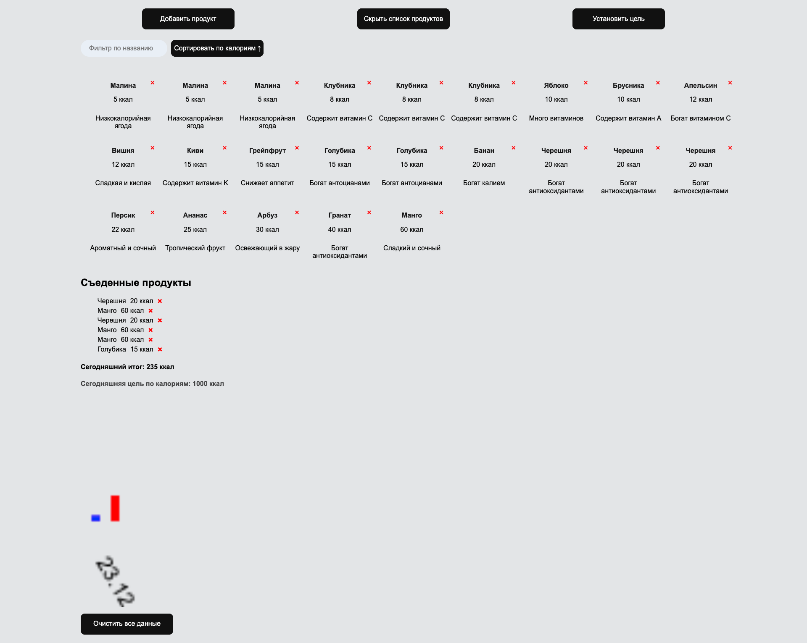

# CalorieCalculatorJS
___
## Описание: 
### Это простое интерактивное приложение, для отслеживания потребления калорий.

___

___

### Как использовать

1. **Добавление продуктов в общий список:**
  - Добавьте продукты, указав название, калорийность и описание.
  - Продукты будут сохранены в localStorage и подгружены при следующем открытии страницы.
  - Вы можете удалять продукты из списка.
  - Продукты можно сортировать и фильтровать.

2. **Установка целевых калорий на текущий день:**
  - Введите желаемую целевую калорийность на текущий день и сохраните.

3. **Отслеживание съеденных продуктов за текущий день:**
  - Съеденные продукты отображаются только за сегодня.
  - Выберите карточку продукта и перетащите ее в область съеденных продуктов.
  - Управляйте списком съеденных продуктов, например, удаляйте отдельные позиции.
  - При превышении установленной нормы калорий вызывается уведомление.

4. **Отображение графика:**
  - На диаграмме показываются соотношения целевых и съеденных калорий по каждой дате.
  - Красным цветом обозначены целевые калории за текущую дату.
  - Синим цветом обозначено общее количество съеденных калорий за текущий день.

5. **Сброс данных:**
  - Вы можете сбросить все данные, используя кнопку "Очистить все данные".

___
## Реализация:

#### 1. **Добавление продуктов:**
- `saveProduct(product)` в `./src/scripts/function/ProductManager.js`:
  - Получает данные продукта и сохраняет его в localStorage.

#### 2. **Удаление продукта:**
- `deleteProduct(productId)` в `./src/scripts/function/ProductManager.js`:
  - Удаляет продукт из localStorage по его ID.

#### 3. **Добавление калорийных целей:**
- `saveGoals(caloriesGoal)` в `./src/scripts/function/ProductManager.js`:
  - Сохраняет установленные целевые калории на текущий день в localStorage.

#### 4. **Добавление съеденных продуктов:**
- `addToSelectedProducts(product)` в `./src/scripts/function/ProductManager.js`:
  - Добавляет продукт к списку съеденных продуктов за текущий день в localStorage.

#### 5. **Удаление съеденного продукта:**
- `removeSelectedProduct(productId)` в `./src/scripts/function/removeSelectedProduct.js`:
  - Удаляет конкретный продукт из списка съеденных продуктов за текущий день в localStorage.

#### 6. **Сброс всех данных:**
- `clearAllData()` в `./src/scripts/function/clearAllData.js`:
  - Удаляет все данные из localStorage и перезагружает страницу.

#### 7. **Отображение продуктов:**
- `displayProducts()` в `./src/scripts/function/displayFunctions.js`:
  - Отображает отфильтрованные и отсортированные продукты.

#### 8. **Отображение целевых калорий:**
- `displayGoals()` в `./src/scripts/function/displayFunctions.js`:
  - Отображает установленные целевые калории на текущий день.

#### 9. **Отображение съеденных продуктов:**
- `displaySelectedProducts()` в `./src/scripts/function/displayFunctions.js`:
  - Отображает съеденные продукты за текущий день.

#### 10. **Отображение графика:**
- `displayChart()` в `./src/scripts/function/cart.js`:
  - Отображает график с соотношением целевых и съеденных калорий по датам.

#### 11. **Открытие и закрытие модальных окон:**
- `openModal()`, `closeModal()`, `openGoalsModal()`, `closeGoalsModal()` в `./src/scripts/function/modal.js`:
  - Отвечают за открытие и закрытие модальных окон.

#### 12. **Отображение предупреждающего модального окна:**
- `showWarningModal()` в `./src/scripts/function/modal.js`:
  - Показывает предупреждающее модальное окно при превышении дневного лимита калорий.

#### 13. **Различные обработчики событий формы продукта:**
- `handleProductFormSubmit(e)`, `handleProductListClick(e)` в `./src/scripts/function/handleProduct.js`:
  - Обрабатывают отправку формы продукта и удаление продукта из списка.

#### 14. **Обработка событий перетаскивания продукта:**
- `allowDrop(e)`, `handleDrop(e)`, `handleDragStart(e, productId)` в `./src/scripts/function/dragAndDropFunctions.js`:
  - Позволяют браузеру обрабатывать событие перетаскивания и обрабатывают события начала и завершения перетаскивания продукта.

#### 15. **`uuid.js`:** Генерация 'уникальных' идентификаторов для продуктов.
